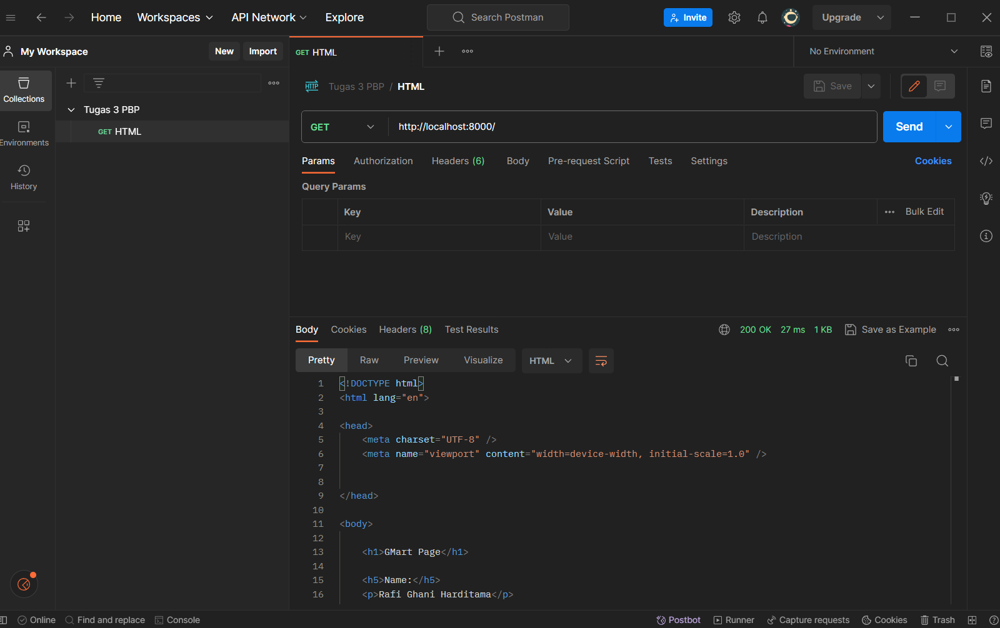
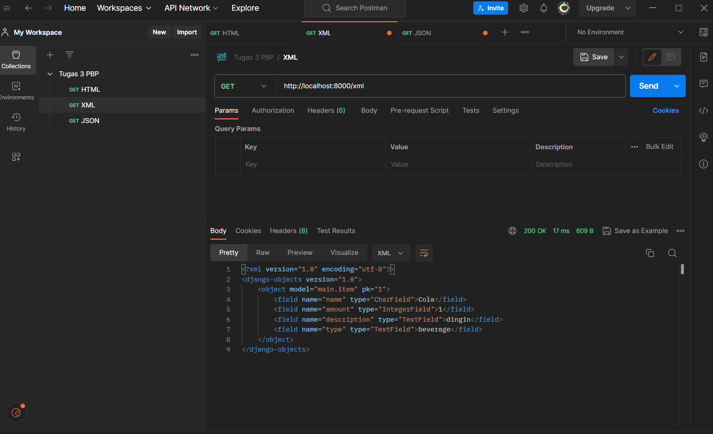
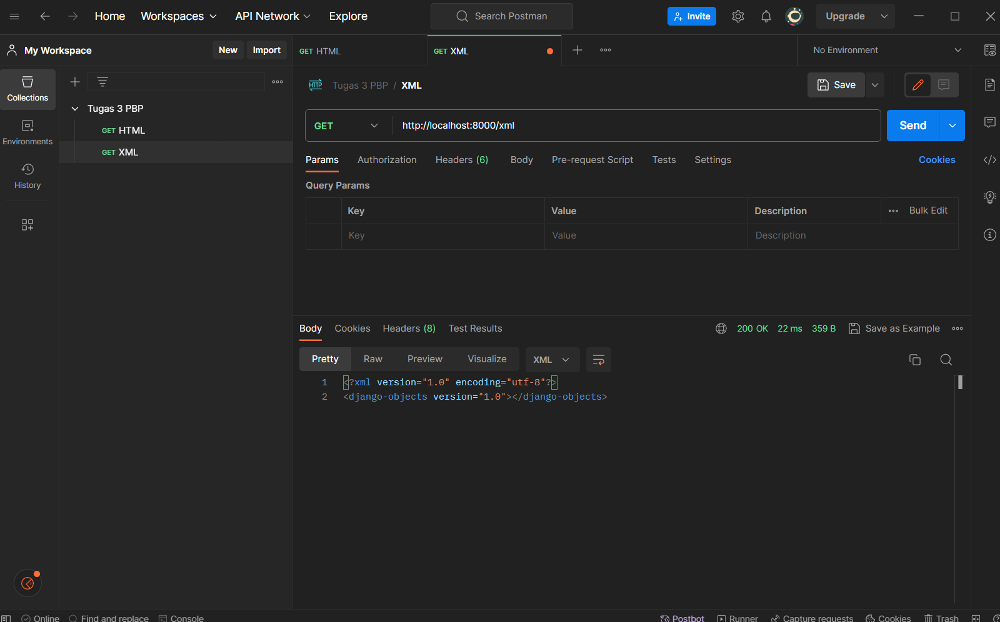
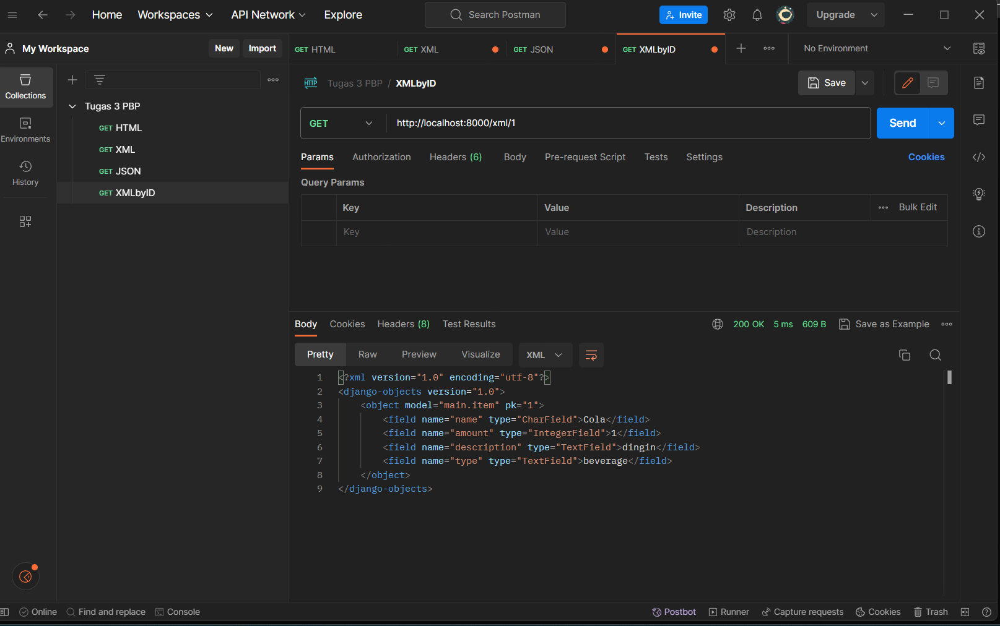
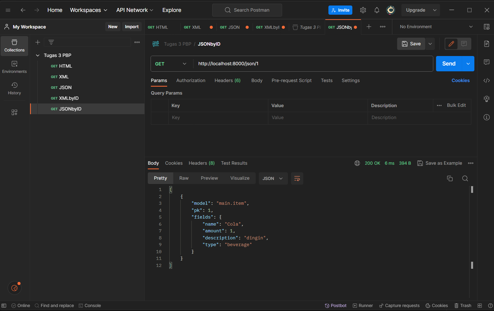

# TUGAS 2

1. Jelaskan bagaimana cara kamu mengimplementasikan checklist di atas secara step-by-step (bukan hanya sekadar mengikuti tutorial).

- [x] Membuat sebuah proyek Django baru.

* Membuat repositori GitHub baru dengan nama GMart
* Membuat direktori lokal bernama GMart dan inisiasikan dengan `git init` dan hubungkan dengan repositori github tersebut dengan perintah `git remote add origin <URL_GMart>`
* buat file `requirements.txt` dengan beberapa _dependencies_
```
django
gunicorn
whitenoise
psycopg2-binary
requests
urllib3
```
* buat _virtual environment_ dengan perintah `python -m venv env` dan aktifkan dengan perintah `env\Scripts\activate.bat`
* install _dependencies_ tadi dengan perintah `pip install -r requirements.txt`
* buat proyek Django dengan nama GMart dengan perintah `django-admin startproject GMart .`
* Tambahkan `*` pada ALLOWED_HOSTS di `settings.py` untuk keperluan deployment.
* Buat berkas `.gitignore` di repositori lokal yang berisi:
```
# Django
*.log
*.pot
*.pyc
__pycache__
db.sqlite3
media

# Backup files
*.bak 

# If you are using PyCharm
# User-specific stuff
.idea/**/workspace.xml
.idea/**/tasks.xml
.idea/**/usage.statistics.xml
.idea/**/dictionaries
.idea/**/shelf

# AWS User-specific
.idea/**/aws.xml

# Generated files
.idea/**/contentModel.xml

# Sensitive or high-churn files
.idea/**/dataSources/
.idea/**/dataSources.ids
.idea/**/dataSources.local.xml
.idea/**/sqlDataSources.xml
.idea/**/dynamic.xml
.idea/**/uiDesigner.xml
.idea/**/dbnavigator.xml

# Gradle
.idea/**/gradle.xml
.idea/**/libraries

# File-based project format
*.iws

# IntelliJ
out/

# JIRA plugin
atlassian-ide-plugin.xml

# Python
*.py[cod] 
*$py.class 

# Distribution / packaging 
.Python build/ 
develop-eggs/ 
dist/ 
downloads/ 
eggs/ 
.eggs/ 
lib/ 
lib64/ 
parts/ 
sdist/ 
var/ 
wheels/ 
*.egg-info/ 
.installed.cfg 
*.egg 
*.manifest 
*.spec 

# Installer logs 
pip-log.txt 
pip-delete-this-directory.txt 

# Unit test / coverage reports 
htmlcov/ 
.tox/ 
.coverage 
.coverage.* 
.cache 
.pytest_cache/ 
nosetests.xml 
coverage.xml 
*.cover 
.hypothesis/ 

# Jupyter Notebook 
.ipynb_checkpoints 

# pyenv 
.python-version 

# celery 
celerybeat-schedule.* 

# SageMath parsed files 
*.sage.py 

# Environments 
.env 
.venv 
env/ 
venv/ 
ENV/ 
env.bak/ 
venv.bak/ 

# mkdocs documentation 
/site 

# mypy 
.mypy_cache/ 

# Sublime Text
*.tmlanguage.cache 
*.tmPreferences.cache 
*.stTheme.cache 
*.sublime-workspace 
*.sublime-project 

# sftp configuration file 
sftp-config.json 

# Package control specific files Package 
Control.last-run 
Control.ca-list 
Control.ca-bundle 
Control.system-ca-bundle 
GitHub.sublime-settings 

# Visual Studio Code
.vscode/* 
!.vscode/settings.json 
!.vscode/tasks.json 
!.vscode/launch.json 
!.vscode/extensions.json 
.history
```

- [x] Membuat aplikasi dengan nama main pada proyek tersebut.

* aktifkan _virtual environment_ dan buat aplikasi baru `main` dalam proyek GMart dengan perintah `python manage.py startapp main`
* Mendaftarkan `main` dalam proyek dengan menambahkan `'main'` pada variabel `INSTALLED_APPS` di dalam berkas `settings.py` pada direktori `GMart`

```
INSTALLED_APPS = [
    ...,
    'main',
    ...
]
```

-  Melakukan _routing_ pada proyek agar dapat menjalankan aplikasi `main`.

* buat berkas `urls.py` di dalam direktori `main` yang berisi:
```
from django.urls import path
from main.views import show_main

app_name = 'main'

urlpatterns = [
    path('', show_main, name='show_main'),
]
```
* Buka berkas `urls.py` di dalam direktori proyek GMart, impor fungsi `include` dari `django.urls`
```
...
from django.urls import path, include
...
```
* tambahkan rute URL seperti berikut untuk mengarahkan ke tampilan `main` di dalam variabel `urlpatterns`
```
urlpatterns = [
    ...
    path('main/', include('main.urls')),
    ...
]
```

- [x] membuat model pada aplikasi `main`

* isi berkas models.py pada direktori aplikasi `main` dengan kode:
```
from django.db import models

class Product(models.Model):
    name = models.CharField(max_length=255)
    amount = models.IntegerField()
    description = models.TextField()
    type = models.TextField()
```

* migrasi model dengan perintah:
```
python manage.py makemigrations
```
* migrasi ke dalam basis data lokal dengan perintah:
```
python manage.py migrate
```

- [x] Membuat sebuah fungsi pada views.py untuk dikembalikan ke dalam sebuah template HTML yang menampilkan nama aplikasi serta nama dan kelas

* membuat direktori `templates` pada direktori aplikasi `main`
* buat berkas `main.html` pada direktori `templates` yang berisi:
```
<h1>GMart Page</h1>

<h5>Name: </h5>
<p>{{ name }}<p>
<h5>Class: </h5>
<p>{{ class }}<p>
```
* buka berkas `views.py` yang terletak di dalam berkas aplikasi `main` dan isi dengan
```
def show_main(request):
    context = {
        'name': 'Rafi Ghani Harditama',
        'class': 'PBP E'
    }

    return render(request, "main.html", context)
```

- [x] Membuat sebuah routing pada `urls.py` aplikasi `main` untuk memetakan fungsi yang telah dibuat pada `views.py`

* buat berkas `urls.py` di dalam direktori `main`
* isi urls.py dengan kode berikut.
```
from django.urls import path
from main.views import show_main

app_name = 'main'

urlpatterns = [
    path('', show_main, name='show_main'),
]
```

- [x] Melakukan deployment ke Adaptable terhadap aplikasi yang sudah dibuat

* Lakukan `add`, `commit`, dan `push` dari direktori repositori lokal ke repositori GMart di GitHub dengan menggunakan perintah
```
git add .
```
```
git commit -m "<KOMENTAR>"
```
```
git push -u origin main
```

* Masuk ke _website_ Adaptable.io dan tombol `New App`. Pilih `Connect an Existing Repository`
* Pilihlah repositori proyek `GMart` sebagai basis aplikasi yang akan di-_deploy_. Pilih _branch_ yang ingin dijadikan sebagai _deployment branch_
* Pilihlah `Python App Template` sebagai _template deployment_
* Pilih `PostgreSQL` sebagai tipe basis data yang akan digunakan
* Pilih Phyton versi 3.11
* Pada bagian `Start Command` masukkan perintah `python manage.py migrate && gunicorn shopping_list.wsgi`
* Masukkan nama aplikasi yang akan menjadi _domain_ web
* Centang bagian `HTTP Listener on PORT` dan klik `Deploy App` untuk memulai proses deployment aplikasi.

2. Buatlah bagan yang berisi request client ke web aplikasi berbasis Django beserta responnya dan jelaskan pada bagan tersebut kaitan antara urls.py, views.py, models.py, dan berkas html.


* User: merupakan pengguna(user) yang menjalankan/mengakses web aplikasi
* URLConf(`urls.py`): file yang berfungsi untuk mengatur pola URL yang akan diatur oleh views dalam aplikasi
* Model (`models.py`): file yang berfungsi untuk mendefinisikan struktur data aplikasi dan logika bisnis yang akan disimpan dalam database.
* View (`views.py`): file yang berfungsi sebagai tempat menyimpan model data kita dan hubungan antara data-data tersebut di dalam database
* Template: file HTML yang berfungsi untuk mengatur tampilan dalam aplikasi web. 
* Database: Tempat dimana aplikasi web disimpan secara permanen. 

Dalam pengembangan aplikasi web dengan Django, `urls.py` mengatur pola URL yang mengarahkan permintaan pengguna ke fungsi-fungsi views di `views.py`. Views berperan sebagai perantara antara model di `models.py` dan file template. Saat user melakukan permintaan, `urls.py` menentukan views yang akan menangani permintaan tersebut. Kemudian, views menggunakan model dari `models.py` untuk mengakses data dalam database sesuai dengan permintaan. Selanjutnya, views merender file Template yang sesuai dengan data dan mengirim respons ke pengguna sebagai halaman web. 

3. Jelaskan mengapa kita menggunakan virtual environment? Apakah kita tetap dapat membuat aplikasi web berbasis Django tanpa menggunakan virtual environment?

_Virtual environment_ adalah alat yang digunakan untuk menciptakan suatu ruang lingkup virtual yang terisolasi secara independen dari _dependencies_ utama. Dengan _virtual environment_, dapat memungkinkan kita untuk menghindari konflik dari _dependencies-dependecies_ yang dapat saling bertabrakan.

Walaupun kita dapat membuat aplikasi web berbasis Django tanpa menggunakan _virtual environment_, sangat disarankan untuk tetap menggunakan _virtual environment_ dalam pengembangan Django. Hal tersebut karena menggunakan _virtual environment_ merupakan _best practice_ karena dapat membantu proyek tetap terorganisir, mencegah terjadinya konflik, dan memudahkan manajemen dependensi. Dengan demikian, membuat aplikasi web berbasis Django dengan menggunakan _virtual environment_ merupakan _best practice_ dan lebih efektif dibandingkan dengan tidak menggunakannya.

4. Jelaskan apakah itu MVC, MVT, MVVM dan perbedaan dari ketiganya.

* MVC (Model-View-Controller) adalah konsep arsitektur yang memisahkan aplikasi menjadi 3 komponen yaitu Model, View dan Controller
  + Model: Komponen yang bertanggung jawab untuk mengatur dan mengelola data dari aplikasi
  + View: komponen yang menangani logika presentasi. View mengontrol bagaimana data yang dikelola oleh model akan ditampilkan kepada pengguna
  + Controller: komponen yang menghubungkan model dan view dalam setiap proses request dari user
    
* MVT (Model-View-Template) adalah konsep arsitektur yang memisahkan aplikasi menjadi 3 komponen yaitu Model, View dan Template
  + Model: Komponen yang bertanggung jawab untuk mengatur dan mengelola data dari aplikasi
  + View: komponen yang menangani logika presentasi. View mengontrol bagaimana data yang dikelola oleh model akan ditampilkan kepada pengguna
  + Template: komponen yang berfungsi untuk mengatur tampilan atau antarmuka pengguna
    
* MVVM (Model-View-ViewModel)adalah konsep arsitektur yang memisahkan aplikasi menjadi 3 komponen yaitu Model, View dan ViewModel
  + Model: Komponen yang bertanggung jawab untuk mengatur dan mengelola data dari aplikasi
  + View: komponen yang menangani logika presentasi. View mengontrol bagaimana data yang dikelola oleh model akan ditampilkan kepada pengguna
  + ViewModel: komponen yang berfungsi untuk berinteraksi dengan model di mana data yang ada akan diteruskan ke layer view

Perbedaan ketiganya terletak pada bagaimana komponen-komponen tersebut saling berinteraksi dan memisahkan tanggung jawab mereka dalam pengembangan aplikasi. MVC lebih terfokus pada pengendalian aliran aplikasi, MVT memisahkan tampilan dengan markup HTML

# TUGAS 3 

1. Apa perbedaan antara form POST dan form GET dalam Django?

| POST   | GET   |
| ---    | ---   |
|Data dikirimkan dalam bentuk _request body_, sehingga tidak terlihat di URL.|Data dikirimkan sebagai _query string_ yang terlihat di URL|
|Memiliki batas ukuran data yang lebih besar dibandingkan ```GET```|Terbatas dalam ukuran data karena ada batasan panjang URL pada beberapa server dan browser|
|Cocok untuk mengirim data sensitif karena tidak terlihat di URL| Kurang aman untuk data sensitif karena lebih mudah diakses oleh pengguna dengan URL|
|Biasanya digunakan untuk mengirimkan data yang memiliki dampak terhadap server|Biasanya digunakan untuk mengirimkan data yang tidak berpengaruh terhadap server|

2. Apa perbedaan utama antara XML, JSON, dan HTML dalam konteks pengiriman data?

* XML merupakan _markup language_ yang digunakan untuk menyimpan dan mengirim data dalam format yang sangat fleksibel dengan struktur pohon dan _user_ dapat membuat tag tambahan sesuai dengan kebutuhan. Meskipun fleksibel, markup XML seringkali rumit dan sulit dibaca.
* JSON merupakan format pengiriman yang cenderung sederhana dan mudah untuk dimengerti oleh manusia dengan pasangan key-value. Selain itu, JSON juga relatif ringan dibandingkan dngan format data lainnya. Hal tersebut membuatnya sangat efektif dalam pertukaran data dibandingkan dengan format data lainnya.
* HTML adalah _markup language_ yang digunakan untuk membuat struktur dan tampilan halaman web. Berbeda dengan JSON dan XML yang dapat membuat tag mereka sendiri, HTML memiliki tag bawaan yang telah ditentukan sebelumnya untuk elemen-elemen seperti teks, gambar, tautan, dan lainnya.


3. Mengapa JSON sering digunakan dalam pertukaran data antara aplikasi web modern?

* JSON lebih mudah untuk dipahami karena memiliki format yang sederhana dan array yang mudah dipahami oleh manusia.
* Fleksibel karena memungkinkan perubahan struktur data dengan mudah tanpa perlu mengubah skema secara signifikan.
* JSON compatible dengan hampir semua bahsa pemrograman seperti JavaScript, Python, Ruby, Java, C#, dll
* JSON adalah format data yang relatif ringan dibandingkan dngan format data lainnya, sehingga mengurangi latensi dan memungkinkan pertukaran data yang lebih cepat dibandingkan dengan format data lainnya.

4. Jelaskan bagaimana cara kamu mengimplementasikan checklist di atas secara step-by-step (bukan hanya sekadar mengikuti tutorial).

* Buat _folder_ ```templates``` pada _root folder_ dan buat _file_ HTML bernama ```base.html```. Isi dari ```base.html```:
```

<!DOCTYPE html>
<html lang="en">
    <head>
        <meta charset="UTF-8" />
        <meta
            name="viewport"
            content="width=device-width, initial-scale=1.0"
        />
        
        
    </head>

    <body>
        
        
    </body>
</html>
```

* Buka  ```settings.py``` pada subdirektori ```GMart``` dan tambahkan kode ```BASE_DIR / 'templates``` pada variabel ```TEMPLATES``` 
```
...
TEMPLATES = [
    {
        'BACKEND': 'django.template.backends.django.DjangoTemplates',
        'DIRS': [BASE_DIR / 'templates'], # Tambahkan kode ini
        'APP_DIRS': True,
        ...
    }
]
...
```

* Ubah kode pada ```main.html``` di subdirektori ```templates``` yang ada di direktori ```main``` menjadi:
```



    <h1>Shopping List Page</h1>

    <h5>Name:</h5>
    <p>{{name}}</p>

    <h5>Class:</h5>
    <p>{{class}}</p>

```

- [x] Membuat input form untuk menambahkan objek model pada app sebelumnya.

* Buat berkas baru pada direktori ```main``` dengan nama ```forms.py``` untuk membuat struktur form yang dapat menerima data produk baru. isi dari ```forms.py```:
```
from django.forms import ModelForm
from main.models import Item

class ItemForm(ModelForm):
    class Meta:
        model = Item
        fields = ["name", "amount", "description", "type"]
```

* Buka berkas ```views.py``` yang ada pada folder ```main``` dan tambahkan beberapa _import_ berikut pada bagian paling atas
```
from main.forms import ItemForm
from django.urls import reverse
from main.models import Item
```

* Buat fungsi baru bernama ```create_product``` dengan kode
```
def create_product(request):
    form = ItemForm(request.POST or None)

    if form.is_valid() and request.method == "POST":
        form.save()
        return HttpResponseRedirect(reverse('main:show_main'))
```

* Ubah fungsi ```show_main``` menjadi
```
def show_main(request):
    item = Item.objects.all()
    context = {
        'name': 'Rafi Ghani Harditama',
        'class': 'PBP E',
        'item': item
    }
    return render(request, "main.html", context)
```

* Buka ```urls.py``` yang ada pada folder ```main``` dan _import_ fungsi ```create_product``` tadi 
```
from main.views import show_main, create_product
```

* Tambahkan _path url_ ke dalam ```urlpatterns``` pada ```urls.py``` di ```main``` untuk mengakses fungsi yang sudah di-_import_ tadi
```
path('create-product', create_product, name='create_product'),
```

* Buat berkas HTML baru dengan nama ```create_product.html``` pada direktori ```main/templates```. Isi ```create_product.html``` dengan kode berikut:
```
 


<h1>Add New Item</h1>

<form method="POST">
    
    <table>
        {{ form.as_table }}
        <tr>
            <td></td>
            <td>
                <input type="submit" value="Add Item"/>
            </td>
        </tr>
    </table>
</form>


```

* Tambahkan kode berikut di dalam ``````untuk menampilkan data produk dalam bentuk table serta tombol "Add New Product" pada ```main.html``` 
```
<table>
        <tr>
            <th>Name</th>
            <th>Amount</th>
            <th>Description</th>
            <th>Type</th>
        </tr>
    
         Berikut cara memperlihatkan data produk di bawah baris ini 
    
        
            <tr>
                <td>{{item.name}}</td>
                <td>{{item.amount}}</td>
                <td>{{item.description}}</td>
                <td>{{item.type}}</td>
            </tr>
        
    </table>
    
    <br />
    
    <a href="">
        <button>
            Add New Item
        </button>
    </a>
```

- [x] Tambahkan 5 fungsi views untuk melihat objek yang sudah ditambahkan dalam format HTML, XML, JSON, XML by ID, dan JSON by ID.

* Tambahkan _import_ ```HttpResponse``` dan ```Serializer``` pada ```views.py``` yang ada pada folder ```main```
```
from django.http import HttpResponse
from django.core import serializers
```

* Buat fungsi untuk mengirimkan data dalam berbagai format data di ```view.py```
    + XML
    ```
    def show_xml(request):
        data = Item.objects.all()
        return HttpResponse(serializers.serialize("xml", data), content_type="application/xml")
    ```
    
    + JSON
    ```
    def show_json(request):
        data = Item.objects.all()
        return HttpResponse(serializers.serialize("json", data), content_type="application/json")
    ```

    + XML by ID
    ```
    def show_xml_by_id(request, id):
        data = Item.objects.filter(pk=id)
        return HttpResponse(serializers.serialize("xml", data), content_type="application/xml")
    ```
    
    + JSON by ID
    ```
    def show_json_by_id(request, id):
        data = Item.objects.filter(pk=id)
        return HttpResponse(serializers.serialize("json", data), content_type="application/json")
    ```

- [x]  Membuat routing URL untuk masing-masing views yang telah ditambahkan pada poin 2.

* Buka ```urls.py``` pada direktori ```main``` dan import fungsi yang sudah kita buat di poin 2. Kemudian, tambahkan path url di ```urlpatterns``` untuk dapat diakses
```
from django.urls import path
from main.views import show_main,  create_product, show_xml, show_json, show_xml_by_id, show_json_by_id 

app_name = 'main'

urlpatterns = [
    path('', show_main, name='show_main'),
    path('create-product', create_product, name='create_product'),
    path('xml/', show_xml, name='show_xml'), 
    path('json/', show_json, name='show_json'),
    path('xml/<int:id>/', show_xml_by_id, name='show_xml_by_id'),
    path('json/<int:id>/', show_json_by_id, name='show_json_by_id'), 
]
```

- [x] BONUS! Menambahkan pesan "Kamu menyimpan X item pada aplikasi ini" 

* menamahkan kode ```'kumlah_item': item.count()``` pada fungsi ```show_main``` di ```views.py``` pada direktori ```main``` sehingga kode pada  fungsi ```show_main``` menjadi berikut
```
def show_main(request):
    item = Item.objects.all()
    context = {
        'name': 'Rafi Ghani Harditama',
        'class': 'PBP E',
        'item': item,
        'jumlah_item': item.count()
    }
    return render(request, "main.html", context)
```

* menambahkan kode ```<p>Kamu menyimpan {{ jumlah_item }} item pada aplikasi ini </p>``` pada ```main.html``` di subdirektori ```templates``` yang ada di direktori ```main```

- [x] Mengakses kelima URL di poin 2 menggunakan Postman, membuat screenshot dari hasil akses URL pada Postman, dan menambahkannya ke dalam README.md.

* HTML


* XML


* JSON


* XML by ID


* JSON by ID
