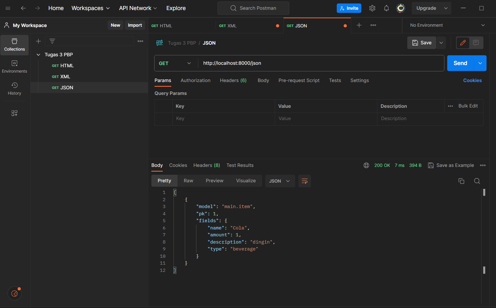

# TUGAS 2

<details>
<summary>1. Jelaskan bagaimana cara kamu mengimplementasikan checklist di atas secara step-by-step (bukan hanya sekadar mengikuti tutorial).</summary>

- [x] Membuat sebuah proyek Django baru.

* Membuat repositori GitHub baru dengan nama GMart
* Membuat direktori lokal bernama GMart dan inisiasikan dengan `git init` dan hubungkan dengan repositori github tersebut dengan perintah `git remote add origin <URL_GMart>`
* buat file `requirements.txt` dengan beberapa _dependencies_
```
django
gunicorn
whitenoise
psycopg2-binary
requests
urllib3
```
* buat _virtual environment_ dengan perintah `python -m venv env` dan aktifkan dengan perintah `env\Scripts\activate.bat`
* install _dependencies_ tadi dengan perintah `pip install -r requirements.txt`
* buat proyek Django dengan nama GMart dengan perintah `django-admin startproject GMart .`
* Tambahkan `*` pada ALLOWED_HOSTS di `settings.py` untuk keperluan deployment.
* Buat berkas `.gitignore` di repositori lokal yang berisi:
```
# Django
*.log
*.pot
*.pyc
__pycache__
db.sqlite3
media

# Backup files
*.bak 

# If you are using PyCharm
# User-specific stuff
.idea/**/workspace.xml
.idea/**/tasks.xml
.idea/**/usage.statistics.xml
.idea/**/dictionaries
.idea/**/shelf

# AWS User-specific
.idea/**/aws.xml

# Generated files
.idea/**/contentModel.xml

# Sensitive or high-churn files
.idea/**/dataSources/
.idea/**/dataSources.ids
.idea/**/dataSources.local.xml
.idea/**/sqlDataSources.xml
.idea/**/dynamic.xml
.idea/**/uiDesigner.xml
.idea/**/dbnavigator.xml

# Gradle
.idea/**/gradle.xml
.idea/**/libraries

# File-based project format
*.iws

# IntelliJ
out/

# JIRA plugin
atlassian-ide-plugin.xml

# Python
*.py[cod] 
*$py.class 

# Distribution / packaging 
.Python build/ 
develop-eggs/ 
dist/ 
downloads/ 
eggs/ 
.eggs/ 
lib/ 
lib64/ 
parts/ 
sdist/ 
var/ 
wheels/ 
*.egg-info/ 
.installed.cfg 
*.egg 
*.manifest 
*.spec 

# Installer logs 
pip-log.txt 
pip-delete-this-directory.txt 

# Unit test / coverage reports 
htmlcov/ 
.tox/ 
.coverage 
.coverage.* 
.cache 
.pytest_cache/ 
nosetests.xml 
coverage.xml 
*.cover 
.hypothesis/ 

# Jupyter Notebook 
.ipynb_checkpoints 

# pyenv 
.python-version 

# celery 
celerybeat-schedule.* 

# SageMath parsed files 
*.sage.py 

# Environments 
.env 
.venv 
env/ 
venv/ 
ENV/ 
env.bak/ 
venv.bak/ 

# mkdocs documentation 
/site 

# mypy 
.mypy_cache/ 

# Sublime Text
*.tmlanguage.cache 
*.tmPreferences.cache 
*.stTheme.cache 
*.sublime-workspace 
*.sublime-project 

# sftp configuration file 
sftp-config.json 

# Package control specific files Package 
Control.last-run 
Control.ca-list 
Control.ca-bundle 
Control.system-ca-bundle 
GitHub.sublime-settings 

# Visual Studio Code
.vscode/* 
!.vscode/settings.json 
!.vscode/tasks.json 
!.vscode/launch.json 
!.vscode/extensions.json 
.history
```

- [x] Membuat aplikasi dengan nama main pada proyek tersebut.

* aktifkan _virtual environment_ dan buat aplikasi baru `main` dalam proyek GMart dengan perintah `python manage.py startapp main`
* Mendaftarkan `main` dalam proyek dengan menambahkan `'main'` pada variabel `INSTALLED_APPS` di dalam berkas `settings.py` pada direktori `GMart`

```
INSTALLED_APPS = [
    ...,
    'main',
    ...
]
```

-  Melakukan _routing_ pada proyek agar dapat menjalankan aplikasi `main`.

* buat berkas `urls.py` di dalam direktori `main` yang berisi:
```
from django.urls import path
from main.views import show_main

app_name = 'main'

urlpatterns = [
    path('', show_main, name='show_main'),
]
```
* Buka berkas `urls.py` di dalam direktori proyek GMart, impor fungsi `include` dari `django.urls`
```
...
from django.urls import path, include
...
```
* tambahkan rute URL seperti berikut untuk mengarahkan ke tampilan `main` di dalam variabel `urlpatterns`
```
urlpatterns = [
    ...
    path('main/', include('main.urls')),
    ...
]
```

- [x] membuat model pada aplikasi `main`

* isi berkas models.py pada direktori aplikasi `main` dengan kode:
```
from django.db import models

class Product(models.Model):
    name = models.CharField(max_length=255)
    amount = models.IntegerField()
    description = models.TextField()
    type = models.TextField()
```

* migrasi model dengan perintah:
```
python manage.py makemigrations
```
* migrasi ke dalam basis data lokal dengan perintah:
```
python manage.py migrate
```

- [x] Membuat sebuah fungsi pada views.py untuk dikembalikan ke dalam sebuah template HTML yang menampilkan nama aplikasi serta nama dan kelas

* membuat direktori `templates` pada direktori aplikasi `main`
* buat berkas `main.html` pada direktori `templates` yang berisi:
```
<h1>GMart Page</h1>

<h5>Name: </h5>
<p>{{ name }}<p>
<h5>Class: </h5>
<p>{{ class }}<p>
```
* buka berkas `views.py` yang terletak di dalam berkas aplikasi `main` dan isi dengan
```
def show_main(request):
    context = {
        'name': 'Rafi Ghani Harditama',
        'class': 'PBP E'
    }

    return render(request, "main.html", context)
```

- [x] Membuat sebuah routing pada `urls.py` aplikasi `main` untuk memetakan fungsi yang telah dibuat pada `views.py`

* buat berkas `urls.py` di dalam direktori `main`
* isi urls.py dengan kode berikut.
```
from django.urls import path
from main.views import show_main

app_name = 'main'

urlpatterns = [
    path('', show_main, name='show_main'),
]
```

- [x] Melakukan deployment ke Adaptable terhadap aplikasi yang sudah dibuat

* Lakukan `add`, `commit`, dan `push` dari direktori repositori lokal ke repositori GMart di GitHub dengan menggunakan perintah
```
git add .
```
```
git commit -m "<KOMENTAR>"
```
```
git push -u origin main
```

* Masuk ke _website_ Adaptable.io dan tombol `New App`. Pilih `Connect an Existing Repository`
* Pilihlah repositori proyek `GMart` sebagai basis aplikasi yang akan di-_deploy_. Pilih _branch_ yang ingin dijadikan sebagai _deployment branch_
* Pilihlah `Python App Template` sebagai _template deployment_
* Pilih `PostgreSQL` sebagai tipe basis data yang akan digunakan
* Pilih Phyton versi 3.11
* Pada bagian `Start Command` masukkan perintah `python manage.py migrate && gunicorn shopping_list.wsgi`
* Masukkan nama aplikasi yang akan menjadi _domain_ web
* Centang bagian `HTTP Listener on PORT` dan klik `Deploy App` untuk memulai proses deployment aplikasi.
</details>

<details>
<summary>2. Buatlah bagan yang berisi request client ke web aplikasi berbasis Django beserta responnya dan jelaskan pada bagan tersebut kaitan antara urls.py, views.py, models.py, dan berkas html.</summary>


* User: merupakan pengguna(user) yang menjalankan/mengakses web aplikasi
* URLConf(`urls.py`): file yang berfungsi untuk mengatur pola URL yang akan diatur oleh views dalam aplikasi
* Model (`models.py`): file yang berfungsi untuk mendefinisikan struktur data aplikasi dan logika bisnis yang akan disimpan dalam database.
* View (`views.py`): file yang berfungsi sebagai tempat menyimpan model data kita dan hubungan antara data-data tersebut di dalam database
* Template: file HTML yang berfungsi untuk mengatur tampilan dalam aplikasi web. 
* Database: Tempat dimana aplikasi web disimpan secara permanen. 

Dalam pengembangan aplikasi web dengan Django, `urls.py` mengatur pola URL yang mengarahkan permintaan pengguna ke fungsi-fungsi views di `views.py`. Views berperan sebagai perantara antara model di `models.py` dan file template. Saat user melakukan permintaan, `urls.py` menentukan views yang akan menangani permintaan tersebut. Kemudian, views menggunakan model dari `models.py` untuk mengakses data dalam database sesuai dengan permintaan. Selanjutnya, views merender file Template yang sesuai dengan data dan mengirim respons ke pengguna sebagai halaman web. 
</details>

<details>
<summary>3. Jelaskan mengapa kita menggunakan virtual environment? Apakah kita tetap dapat membuat aplikasi web berbasis Django tanpa menggunakan virtual environment?</summary>

_Virtual environment_ adalah alat yang digunakan untuk menciptakan suatu ruang lingkup virtual yang terisolasi secara independen dari _dependencies_ utama. Dengan _virtual environment_, dapat memungkinkan kita untuk menghindari konflik dari _dependencies-dependecies_ yang dapat saling bertabrakan.

Walaupun kita dapat membuat aplikasi web berbasis Django tanpa menggunakan _virtual environment_, sangat disarankan untuk tetap menggunakan _virtual environment_ dalam pengembangan Django. Hal tersebut karena menggunakan _virtual environment_ merupakan _best practice_ karena dapat membantu proyek tetap terorganisir, mencegah terjadinya konflik, dan memudahkan manajemen dependensi. Dengan demikian, membuat aplikasi web berbasis Django dengan menggunakan _virtual environment_ merupakan _best practice_ dan lebih efektif dibandingkan dengan tidak menggunakannya.
</details>

<details>
<summary>4. Jelaskan apakah itu MVC, MVT, MVVM dan perbedaan dari ketiganya.</summary>

* MVC (Model-View-Controller) adalah konsep arsitektur yang memisahkan aplikasi menjadi 3 komponen yaitu Model, View dan Controller
  + Model: Komponen yang bertanggung jawab untuk mengatur dan mengelola data dari aplikasi
  + View: komponen yang menangani logika presentasi. View mengontrol bagaimana data yang dikelola oleh model akan ditampilkan kepada pengguna
  + Controller: komponen yang menghubungkan model dan view dalam setiap proses request dari user
    
* MVT (Model-View-Template) adalah konsep arsitektur yang memisahkan aplikasi menjadi 3 komponen yaitu Model, View dan Template
  + Model: Komponen yang bertanggung jawab untuk mengatur dan mengelola data dari aplikasi
  + View: komponen yang menangani logika presentasi. View mengontrol bagaimana data yang dikelola oleh model akan ditampilkan kepada pengguna
  + Template: komponen yang berfungsi untuk mengatur tampilan atau antarmuka pengguna
    
* MVVM (Model-View-ViewModel)adalah konsep arsitektur yang memisahkan aplikasi menjadi 3 komponen yaitu Model, View dan ViewModel
  + Model: Komponen yang bertanggung jawab untuk mengatur dan mengelola data dari aplikasi
  + View: komponen yang menangani logika presentasi. View mengontrol bagaimana data yang dikelola oleh model akan ditampilkan kepada pengguna
  + ViewModel: komponen yang berfungsi untuk berinteraksi dengan model di mana data yang ada akan diteruskan ke layer view

Perbedaan ketiganya terletak pada bagaimana komponen-komponen tersebut saling berinteraksi dan memisahkan tanggung jawab mereka dalam pengembangan aplikasi. MVC lebih terfokus pada pengendalian aliran aplikasi, MVT memisahkan tampilan dengan markup HTML
</details>

# TUGAS 3 

<details>
<summary>1. Apa perbedaan antara form POST dan form GET dalam Django?</summary>

| POST   | GET   |
| ---    | ---   |
|Data dikirimkan dalam bentuk _request body_, sehingga tidak terlihat di URL.|Data dikirimkan sebagai _query string_ yang terlihat di URL|
|Memiliki batas ukuran data yang lebih besar dibandingkan ```GET```|Terbatas dalam ukuran data karena ada batasan panjang URL pada beberapa server dan browser|
|Cocok untuk mengirim data sensitif karena tidak terlihat di URL| Kurang aman untuk data sensitif karena lebih mudah diakses oleh pengguna dengan URL|
|Biasanya digunakan untuk mengirimkan data yang memiliki dampak terhadap server|Biasanya digunakan untuk mengirimkan data yang tidak berpengaruh terhadap server|
</details>

<details>
<summary>2. Apa perbedaan utama antara XML, JSON, dan HTML dalam konteks pengiriman data?</summary>

* XML merupakan _markup language_ yang digunakan untuk menyimpan dan mengirim data dalam format yang sangat fleksibel dengan struktur pohon dan _user_ dapat membuat tag tambahan sesuai dengan kebutuhan. Meskipun fleksibel, markup XML seringkali rumit dan sulit dibaca.
* JSON merupakan format pengiriman yang cenderung sederhana dan mudah untuk dimengerti oleh manusia dengan pasangan key-value. Selain itu, JSON juga relatif ringan dibandingkan dngan format data lainnya. Hal tersebut membuatnya sangat efektif dalam pertukaran data dibandingkan dengan format data lainnya.
* HTML adalah _markup language_ yang digunakan untuk membuat struktur dan tampilan halaman web. Berbeda dengan JSON dan XML yang dapat membuat tag mereka sendiri, HTML memiliki tag bawaan yang telah ditentukan sebelumnya untuk elemen-elemen seperti teks, gambar, tautan, dan lainnya.
</details>

<details>
<summary>3. Mengapa JSON sering digunakan dalam pertukaran data antara aplikasi web modern?</summary>

* JSON lebih mudah untuk dipahami karena memiliki format yang sederhana dan array yang mudah dipahami oleh manusia.
* Fleksibel karena memungkinkan perubahan struktur data dengan mudah tanpa perlu mengubah skema secara signifikan.
* JSON compatible dengan hampir semua bahsa pemrograman seperti JavaScript, Python, Ruby, Java, C#, dll
* JSON adalah format data yang relatif ringan dibandingkan dngan format data lainnya, sehingga mengurangi latensi dan memungkinkan pertukaran data yang lebih cepat dibandingkan dengan format data lainnya.
</details>

<details>
<summary>4. Jelaskan bagaimana cara kamu mengimplementasikan checklist di atas secara step-by-step (bukan hanya sekadar mengikuti tutorial).</summary>

* Buat _folder_ ```templates``` pada _root folder_ dan buat _file_ HTML bernama ```base.html```. Isi dari ```base.html```:
```

<!DOCTYPE html>
<html lang="en">
    <head>
        <meta charset="UTF-8" />
        <meta
            name="viewport"
            content="width=device-width, initial-scale=1.0"
        />
        
        
    </head>

    <body>
        
        
    </body>
</html>
```

* Buka  ```settings.py``` pada subdirektori ```GMart``` dan tambahkan kode ```BASE_DIR / 'templates``` pada variabel ```TEMPLATES``` 
```
...
TEMPLATES = [
    {
        'BACKEND': 'django.template.backends.django.DjangoTemplates',
        'DIRS': [BASE_DIR / 'templates'], # Tambahkan kode ini
        'APP_DIRS': True,
        ...
    }
]
...
```

* Ubah kode pada ```main.html``` di subdirektori ```templates``` yang ada di direktori ```main``` menjadi:
```



    <h1>Shopping List Page</h1>

    <h5>Name:</h5>
    <p>{{name}}</p>

    <h5>Class:</h5>
    <p>{{class}}</p>

```

- [x] Membuat input form untuk menambahkan objek model pada app sebelumnya.

* Buat berkas baru pada direktori ```main``` dengan nama ```forms.py``` untuk membuat struktur form yang dapat menerima data produk baru. isi dari ```forms.py```:
```
from django.forms import ModelForm
from main.models import Item

class ItemForm(ModelForm):
    class Meta:
        model = Item
        fields = ["name", "amount", "description", "type"]
```

* Buka berkas ```views.py``` yang ada pada folder ```main``` dan tambahkan beberapa _import_ berikut pada bagian paling atas
```
from main.forms import ItemForm
from django.urls import reverse
from main.models import Item
```

* Buat fungsi baru bernama ```create_product``` dengan kode
```
def create_product(request):
    form = ItemForm(request.POST or None)

    if form.is_valid() and request.method == "POST":
        form.save()
        return HttpResponseRedirect(reverse('main:show_main'))
```

* Ubah fungsi ```show_main``` menjadi
```
def show_main(request):
    item = Item.objects.all()
    context = {
        'name': 'Rafi Ghani Harditama',
        'class': 'PBP E',
        'item': item
    }
    return render(request, "main.html", context)
```

* Buka ```urls.py``` yang ada pada folder ```main``` dan _import_ fungsi ```create_product``` tadi 
```
from main.views import show_main, create_product
```

* Tambahkan _path url_ ke dalam ```urlpatterns``` pada ```urls.py``` di ```main``` untuk mengakses fungsi yang sudah di-_import_ tadi
```
path('create-product', create_product, name='create_product'),
```

* Buat berkas HTML baru dengan nama ```create_product.html``` pada direktori ```main/templates```. Isi ```create_product.html``` dengan kode berikut:
```
 


<h1>Add New Item</h1>

<form method="POST">
    
    <table>
        {{ form.as_table }}
        <tr>
            <td></td>
            <td>
                <input type="submit" value="Add Item"/>
            </td>
        </tr>
    </table>
</form>


```

* Tambahkan kode berikut di dalam ``````untuk menampilkan data produk dalam bentuk table serta tombol "Add New Product" pada ```main.html``` 
```
<table>
        <tr>
            <th>Name</th>
            <th>Amount</th>
            <th>Description</th>
            <th>Type</th>
        </tr>
    
         Berikut cara memperlihatkan data produk di bawah baris ini 
    
        
            <tr>
                <td>{{item.name}}</td>
                <td>{{item.amount}}</td>
                <td>{{item.description}}</td>
                <td>{{item.type}}</td>
            </tr>
        
    </table>
    
    <br />
    
    <a href="">
        <button>
            Add New Item
        </button>
    </a>
```

- [x] Tambahkan 5 fungsi views untuk melihat objek yang sudah ditambahkan dalam format HTML, XML, JSON, XML by ID, dan JSON by ID.

* Tambahkan _import_ ```HttpResponse``` dan ```Serializer``` pada ```views.py``` yang ada pada folder ```main```
```
from django.http import HttpResponse
from django.core import serializers
```

* Buat fungsi untuk mengirimkan data dalam berbagai format data di ```view.py```
    + XML
    ```
    def show_xml(request):
        data = Item.objects.all()
        return HttpResponse(serializers.serialize("xml", data), content_type="application/xml")
    ```
    
    + JSON
    ```
    def show_json(request):
        data = Item.objects.all()
        return HttpResponse(serializers.serialize("json", data), content_type="application/json")
    ```

    + XML by ID
    ```
    def show_xml_by_id(request, id):
        data = Item.objects.filter(pk=id)
        return HttpResponse(serializers.serialize("xml", data), content_type="application/xml")
    ```
    
    + JSON by ID
    ```
    def show_json_by_id(request, id):
        data = Item.objects.filter(pk=id)
        return HttpResponse(serializers.serialize("json", data), content_type="application/json")
    ```

- [x]  Membuat routing URL untuk masing-masing views yang telah ditambahkan pada poin 2.

* Buka ```urls.py``` pada direktori ```main``` dan import fungsi yang sudah kita buat di poin 2. Kemudian, tambahkan path url di ```urlpatterns``` untuk dapat diakses
```
from django.urls import path
from main.views import show_main,  create_product, show_xml, show_json, show_xml_by_id, show_json_by_id 

app_name = 'main'

urlpatterns = [
    path('', show_main, name='show_main'),
    path('create-product', create_product, name='create_product'),
    path('xml/', show_xml, name='show_xml'), 
    path('json/', show_json, name='show_json'),
    path('xml/<int:id>/', show_xml_by_id, name='show_xml_by_id'),
    path('json/<int:id>/', show_json_by_id, name='show_json_by_id'), 
]
```

- [x] BONUS! Menambahkan pesan "Kamu menyimpan X item pada aplikasi ini" 

* menamahkan kode ```'kumlah_item': item.count()``` pada fungsi ```show_main``` di ```views.py``` pada direktori ```main``` sehingga kode pada  fungsi ```show_main``` menjadi berikut
```
def show_main(request):
    item = Item.objects.all()
    context = {
        'name': 'Rafi Ghani Harditama',
        'class': 'PBP E',
        'item': item,
        'jumlah_item': item.count()
    }
    return render(request, "main.html", context)
```

* menambahkan kode ```<p>Kamu menyimpan {{ jumlah_item }} item pada aplikasi ini </p>``` pada ```main.html``` di subdirektori ```templates``` yang ada di direktori ```main```
</details>

- [x] Mengakses kelima URL di poin 2 menggunakan Postman, membuat screenshot dari hasil akses URL pada Postman, dan menambahkannya ke dalam README.md.

* HTML


* XML


* JSON


* XML by ID


* JSON by ID


# TUGAS 4 

<details>
<summary>1. Apa itu Django ```UserCreationForm```, dan jelaskan apa kelebihan dan kekurangannya?</summary>
```UserCreationForm``` merupakan import yang terdapat pada ```django.contrib.auth.forms``` untuk membuat dan meregister akun baru dalam aplikasi web

Kelebihan:
* Form ini sudah dibuat secara default oleh Django sehingga user tidak perlu membuat kode untuk register sendiri
* Sudah terintegrasi dengan sistem otentikasi Django, seperti login, logout, dll
* Form ini sudah memiliki validasi bawaan untuk mengecek data user sudah sesuai syarat atau belum, seperti password yang dibuat sekuat mungkin dengan harus menggunakan elemen dan angka

Kekurangan:
* Form ini sudah menggunakan desain bawaan sehingga user tidak bisa mengubah desain tersebut
* Tidak bisa dikostumisasi dengan mudah seperti menambahkan field baru karena form ini sudah bawaan dari Django
</details>

<details>
<summary>2. Apa perbedaan antara autentikasi dan otorisasi dalam konteks Django, dan mengapa keduanya penting?</summary>

Autentikasi adalah preses yang dilakukan untuk memverifikasi identitas user yang akan login ke dalam aplikasi web, seperti login dengan memasukkan username dan password. Sementara, otorisasi adalah pengendalian izin atas hal-hal yang boleh dilakukan seorang user dalam aplikasi web tersebut. Keduanya sama pentingnya untuk melindungi aplikasi web. Autentikasi mengecek keaslian pengguna yang dapat masuk ke dalam aplikasi web. Setelah terautentikasi, otorisasi memberikan hak dan informasi yang sesuai kepada user yang sudah terautentikasi dalam mengakses web aplikasi tersebut.  
</details>

<details>
<summary>3. Apa itu cookies dalam konteks aplikasi web, dan bagaimana Django menggunakan cookies untuk mengelola data sesi pengguna?</summary>

Dalam konteks aplikasi web, cookies adalah file kecil yang berisi informasi tentang data pengguna yang dikirim oleh web ke browser dan disimpan pada perangkat user. File ini berguna untuk mengelola data pengguna selama mengakses aplikasi web. Dalam Django, cookies digunakan untuk mengelola data sesi pengguna dengan menyimpan ID sesi dalam cookies di browser pengguna. Namun, data sesi yang sebenernya, seperti status masuk atau preferensi, disimpan di server Django. Cara kerjanya adalah saat pertama kali user mengakses aplikasi web, Django akan membuat ID sesi unik untuk user tersebut. Setiap kali pengguna membuat permintaan, ID sesi digunakan untuk mengidentifikasi sesi pengguna, memungkinkan Django untuk mengembalikan data sesi yang sesuai. 
</details>

<details>
<summary>4. Apakah penggunaan cookies aman secara default dalam pengembangan web, atau apakah ada risiko potensial yang harus diwaspadai?</summary>

Penggunaaan cookies dalam pengembagan web sebenernya cukup aman jika dikelola dengan benar. Namun, tidak menutup adanya risiko potensi yang tetap harus diwaspadai seperti serangan Cross-Site Scripting (XSS) atau Cross-Site Request Forgery (CSRF), kebocoran data, dan pelacakan oleh pihak ketiga. Meskipun begitu, kita tetap dapat mengurangi risiko tersebut salah satunya dengan menggunakan HTTPS.

<summary>5. Jelaskan bagaimana cara kamu mengimplementasikan checklist di atas secara step-by-step (bukan hanya sekadar mengikuti tutorial).</summary>

- [x]  Mengimplementasikan fungsi registrasi, login, dan logout untuk memungkinkan pengguna untuk mengakses aplikasi sebelumnya dengan lancar.

* Registrasi

    + _import_ ```redirect```, ```UserCreationForm```, dan ```messages``` pada berkas ```views.py``` pada subdirektori ```main```
    ```
    from django.shortcuts import redirect
    from django.contrib.auth.forms import UserCreationForm
    from django.contrib import messages  
    ```

    + buatlah fungsi ```register``` dengan kode berikut
    ```
    def register(request):
        form = UserCreationForm()

        if request.method == "POST":
            form = UserCreationForm(request.POST)
            if form.is_valid():
                form.save()
                messages.success(request, 'Your account has been successfully created!')
                return redirect('main:login')
        context = {'form':form}
        return render(request, 'register.html', context)
    ```

    + Buat berkas HTML yang bernama ```register.html``` pada subdirektori ```main/templates``` dengan isi sebagai berikut.
    ```
    

    
        <title>Register</title>
        

      

    <div class = "login">
    
        <h1>Register</h1>  

            <form method="POST" >  
                  
                <table>  
                    {{ form.as_table }}  
                    <tr>  
                        <td></td>
                        <td><input type="submit" name="submit" value="Daftar"/></td>  
                    </tr>  
                </table>  
            </form>

          
            <ul>   
                  
                    <li>{{ message }}</li>  
                      
            </ul>   
        

    </div>  

    
    ```

    + _import_ fungsi register tadi pada ```urls.py``` yang ada di subdirektori ```main``` dan tambahkan _path url_ ke dalam ``` urlpatterns``` 
    ``` from main.views import register```
    ```path('register/', register, name='register'),```

* Login

    + _import_ ```authenticate```, dan ```login``` pada berkas ```views.py``` pada subdirektori ```main```
    ```from django.contrib.auth import authenticate, login```

    + buatlah fungsi ```login``` dengan kode berikut
    ```
    def login_user(request):
        if request.method == 'POST':
            username = request.POST.get('username')
            password = request.POST.get('password')
            user = authenticate(request, username=username, password=password)
            if user is not None:
                login(request, user)
                return redirect('main:show_main')
            else:
                messages.info(request, 'Sorry, incorrect username or password. Please try again.')
        context = {}
        return render(request, 'login.html', context)
    ```

    + Buat berkas HTML yang bernama ```login.html``` pada subdirektori ```main/templates``` dengan isi sebagai berikut.
    ```
    

    
        <title>Login</title>
    

    

    <div class = "login">

       <h1>Login</h1>

        <form method="POST" action="">
            
            <table>
                <tr>
                    <td>Username: </td>
                    <td><input type="text" name="username" placeholder="Username" class="form-control"></td>
                </tr>
                    
                <tr>
                    <td>Password: </td>
                    <td><input type="password" name="password" placeholder="Password" class="form-control"></td>
                </tr>

                <tr>
                    <td></td>
                    <td><input class="btn login_btn" type="submit" value="Login"></td>
                </tr>
            </table>
        </form>

        
            <ul>
                
                    <li>{{ message }}</li>
                
            </ul>
             
        
        Don't have an account yet? <a href="">Register Now</a>

    </div>

    
    ```

    + _import_ fungsi login tadi pada ```urls.py``` yang ada di subdirektori ```main``` dan tambahkan _path url_ ke dalam ``` urlpatterns``` 
    ```from main.views import login_user```
    ```path('login/', login_user, name='login'),```

* Logout

    + _import_ ```logout``` pada berkas ```views.py``` pada subdirektori ```main```
    ```from django.contrib.auth import logout```

    + buatlah fungsi ```logout``` dengan kode berikut
    ```
    def logout_user(request):
        logout(request)
        return redirect('main:login')
    ```

    + tambahkan kode di bawah ini setelah _hyperlink tag_ untuk _Add New Product_ pada berkas ```main.html```
    ```
    ...
    <a href="">
        <button>
            Logout
        </button>
    </a>
    ...    
    ```

    + _import_ fungsi logout tadi pada ```urls.py``` yang ada di subdirektori ```main``` dan tambahkan _path url_ ke dalam ``` urlpatterns``` 
    ```from main.views import logout_user```
    ```path('logout/', logout_user, name='logout'),```

- [x] Membuat dua akun pengguna dengan masing-masing tiga dummy data menggunakan model yang telah dibuat pada aplikasi sebelumnya untuk setiap akun di lokal.

* Membuka localhost pada browser
* tekan tombol register untuk membuat akun (lakukan 2 kali hingga terdapat 2 user)
* Setelah membuat akun, login dengan username dan password yang sudah dibuat
* tekan tombol add new product untuk membuat dummy data (lakukan 3 kali hingga terdapat 3 dummy data pada setiap user)
* kedua akun tersebut sudah memiliki 3 dummy data di masing-masing akun

- [x] Menghubungkan model Item dengan User.

* _import_ ```User``` pada ```models.py``` yang ada pada subdirektori ```main```
```from django.contrib.auth.models import User```

* Tambahkan potongan kode berikut pada model ```Item```
```
class Item(models.Model):
    user = models.ForeignKey(User, on_delete=models.CASCADE)
...
```

* ubah fungsi ```create_product``` pada ```views.py``` yang ada pada subdirektori ```main```
```
def create_item(request):
    form = ItemForm(request.POST or None)

    if form.is_valid() and request.method == "POST":
        item = form.save(commit=False)
        item.user = request.user
        item.save()
        return HttpResponseRedirect(reverse('main:show_main'))
...
```

* ubah fungsi ```show_main``` menjadi
```
def show_main(request):
    products = Product.objects.filter(user=request.user)

    context = {
        'name': request.user.username,
    ...
...
```

* simpan dan lakukan migrasi dengan ```python manage.py makemigrations``` dan ```python manage.py migrate```

- [x] Menampilkan detail informasi pengguna yang sedang logged in seperti username dan menerapkan cookies seperti last login pada halaman utama aplikasi.

* _import_ ```datetime``` pada ```views.py``` yang ada pada subdirektori ```main```
```import datetime```

* tambahkan _cookie_ yang bernama ```last_login``` untuk melihat kapan terakhir kali pengguna melakukan ```login``` eengan mengganti kode pada bagian ```if user is not None``` menjadi kode berikut.
```
if user is not None:
    login(request, user)
    response = HttpResponseRedirect(reverse("main:show_main")) 
    response.set_cookie('last_login', str(datetime.datetime.now()))
    return response
```

* tambahkan kode ```'last_login': request.COOKIES['last_login']``` di variabel ```context``` pada fungsi ```show_main``` sehingga bentuknya menjadi. 
```
context = {
    'name': 'Pak Bepe',
    'class': 'PBP A',
    'products': products,
    'last_login': request.COOKIES['last_login'],
}
```

* Ubah fungsi ```logout_user``` menjadi.
```
def logout_user(request):
    logout(request)
    response = HttpResponseRedirect(reverse('main:login'))
    response.delete_cookie('last_login')
    return response
```

* Pada berkas ```main.html```, tambahkan kode berikut diantara tabel dan tombol _logout_  untuk menampilkan data _last login_.
```
<h5>Sesi terakhir login: {{ last_login }}</h5>
```

- [x] BONUS!Tambahkan tombol dan fungsi untuk menambahkan amount suatu objek sebanyak satu, tombol untuk mengurangi jumlah stok suatu objek sebanyak satu, dan tombol untuk menghapus suatu objek dari inventori.

* Buat fungsi ```add_amount```, ```sub_amount```, dan ```remove_item``` pada ```views.py``` yang ada pada subdirektori ```main```
```
def add_amount(request, id):
    if request == "POST":
        item = Item.objects.get(pk=id)
        item.amount += 1
        item.save()
    return HttpResponseRedirect(reverse('main:show_main'))

def sub_amount(request, id):
    if request == "POST":
        item = Item.objects.get(pk=id)
        if item > 1:
            item.amount -= 1
            item.save()
        else:
            item.delete()
    return HttpResponseRedirect(reverse('main:show_main'))

def remove_item(request, id):
    if request == "POST":
        item = Item.objects.get(pk=id)
        item.delete()
    return HttpResponseRedirect(reverse('main:show_main'))
```

* _import_ fungsi-fungsi tersebut pada ```urls.py``` yang ada di subdirektori ```main``` dan tambahkan _path url_ ke dalam ``` urlpatterns``` 
```
from main.views import add_amount, sub_amount, remove_item
```
```
path('add/<int:id>/', add_amount, name='add_amount'),
path('sub/<int:id>/', sub_amount, name='sub_amount'),
path('remove/<int:id>/', remove_item, name='remove_item'),
```

* Tambahkan kode berikut di dalam tabel pada ```main.html```
```
<td>
    <form method="post" action="">
        
        <button type="submit">Add</button>
    </form>
</td>
<td> 
    <form method="post" action="">
        
        <button type="submit">Subtraction</button>
    </form>
</td>
<td> 
    <form method="post" action="">
        
        <button type="submit">Remove</button>
    </form>
</td>
```
</details>

# TUGAS 5

<details>
<sumary>1. Jelaskan manfaat dari setiap element selector dan kapan waktu yang tepat untuk menggunakannya</sumary>

* Universal Selector (*)
Universal selector bermanfaat untuk memilih semua elemen pada halaman. Biasanya digunakan untuk menetapkan nilai awal pada semua elemen

* Element Selector
Element Selector memungkinkan kita mengubah properti untuk semua elemen yang memiliki tag HTML yang sama. Berguna ketika ingin mengubah gaya untuk semua elemen HTML.

* ID Selector (#)
ID selector menggunakan ID pada tag sebagai selector-nya. ID bersifat unik dalam satu halaman web. ID dapat ditambahkan pada halaman template HTML. Cocok digunakan untuk memilih elemen dengan atribut id tertentu pada halaman.

* Class Selector (.)
Class Selector memungkinkan kita untuk mengelompokkan elemen dengan karakteristik yang sama. Cocok ketika ingin mengganti gaya elemen tertentu yang memiliki class yang sama.
</details>

<details>
<sumary>2. Jelaskan HTML5 Tag yang kamu ketahui</sumary>

* ```<style>```: untuk menyisipkan kode CSS yang biasanya digunakan untuk mengatur dan merubah tampilan pada halaman web
* ```<nav>```: untuk membuat navigasi berupa navigation bar yang biasanya digunakan untuk memberikan informasi penting dari halaman tersebut
* ```<div>```: untuk mengelompokan bagian-bagian pada halaman web tersebut
* ```<a>```: untuk memberikan tautan ke web, file, ataupun url eksternal lainnya
* ```<h1>```: untuk mengatur teks menjadi judul tingkat 1
* ```<table>```: digunakan untuk membuat table
* ```<tr>, <th>, <td>```: elemen elemen pada tabel, tr = menyatakan baris, th: heading dari table tersebut(biasanya baris pertama), td: menyatakan kolom.
* ```<button>```: untuk membuat tombol yang dapat dipencet dan melakukan sebuah perintah
* ```<form>```: membuat formulir/input untuk memasukan data yang nantinya akan disimpan
* ```<header>```: untuk mendefinisikan header atau bagian atas halaman web
* ```<p>```: untuk membuat paragraf
* ``````: untuk menampilkan gambar pada web
* ```<script>```: untuk memasukkan kode javascript
* dst
</details>

<details>
<sumary>3. Jelaskan perbedaan antara margin dan padding</sumary>

Margin adalah sebuah ruang kosong atau jarak di luar elemen HTML yang mengatur jarak antar suatu elemen dengan elemen lainnya, sedangkan Padding adalah ruang kosong atau jarak di dalam elemen HTML yang mengatur jarak antara konten konten dan batasannya pada elemen HTML tersebut. Intinya, Margin mengatur jarak antar elemen, sedangkan padding mengatur tampilan konten elemen.
</details>

<details>
<sumary>4. Jelaskan perbedaan antara framework CSS Tailwind dan Bootstrap. Kapan sebaiknya kita menggunakan Bootstrap daripada Tailwind, dan sebaliknya?</sumary>

| Bootstrap   | Tailwind   |
| ---         | ---        |
|Bootstrap memiliki komponen yang sudah didefinisikan, sehingga kita mendapatkan komponen siap pakai dan dapay langsung digunakan|Tailwind CSS memberikan kontrol lebih kepada kita untuk merancang sendiri tampilan kita|
|memiliki ukuran file CSS yang lebih besar karena sudah memiliki banyak komponen bawaan yang sudah didefinisikan|memiliki ukuran file CSS yang lebih ringan dibandingkan Bootstrap|
|Lebih terbatas jika ingin melakukan kostumisasi karena memiliki banyak komponen bawaan yang sudah didefinisikan|lebih fleksibel untuk hal kostumisasi|

Bootstrap lebih cocok digunakan ketika kita ingin membuat proyek dengan yang membutuhkan pengembangan cepat karena sudah disediakan komponen siap pakai dan gaya yang konsisten. Sedangkan Tailwind lebih cocok digunakan ketika kita yang membutuhkan kreativitas dalam merancang tampilan web karena lebih fleksibel jika ingin kostumisasi komponen pada web tersebut.
</details>

<details>
<sumary>5. Jelaskan bagaimana cara kamu mengimplementasikan checklist di atas secara step-by-step (bukan hanya sekadar mengikuti tutorial). </sumary>

* Menambahkan bootstrap
    + tambahkan kode berikut dalam ```base.html``` agar halaman dapat menyesuaikan ukuran dan perilaku perangkat mobile
    ```
    <head>
        
            <meta charset="UTF-8" />
            <meta name="viewport" content="width=device-width, initial-scale=1">
        
    </head>
    ```
    + Tambahkan Bootstrap CSS dan juga JS.
    CSS
    ```
    <head>
        
            ...
        
        <link href="https://cdn.jsdelivr.net/npm/bootstrap@5.3.2/dist/css/bootstrap.min.css" rel="stylesheet" integrity="sha384-T3c6CoIi6uLrA9TneNEoa7RxnatzjcDSCmG1MXxSR1GAsXEV/Dwwykc2MPK8M2HN" crossorigin="anonymous">
    </head>
    ```
    JS
    ```
    <link href="https://cdn.jsdelivr.net/npm/bootstrap@5.3.2/dist/css/bootstrap.min.css" rel="stylesheet" integrity="sha384-T3c6CoIi6uLrA9TneNEoa7RxnatzjcDSCmG1MXxSR1GAsXEV/Dwwykc2MPK8M2HN" crossorigin="anonymous">
    <script src="https://code.jquery.com/jquery-3.6.0.min.js" integrity="sha384-KyZXEAg3QhqLMpG8r+J4jsl5c9zdLKaUk5Ae5f5b1bw6AUn5f5v8FZJoMxm6f5cH1" crossorigin="anonymous"></script>
    <script src="https://cdn.jsdelivr.net/npm/@popperjs/core@2.11.8/dist/umd/popper.min.js" integrity="sha384-I7E8VVD/ismYTF4hNIPjVp/Zjvgyol6VFvRkX/vR+Vc4jQkC+hVqc2pM8ODewa9r" crossorigin="anonymous"></script>
    <script src="https://cdn.jsdelivr.net/npm/bootstrap@5.3.2/dist/js/bootstrap.min.js" integrity="sha384-BBtl+eGJRgqQAUMxJ7pMwbEyER4l1g+O15P+16Ep7Q9Q+zqX6gSbd85u4mG4QzX+" crossorigin="anonymous"></script>
    ```

* Menambahkan fitur edit pada apikasi

    + tambahkan fungsi ```edit_item``` pada ```views.py```
    ```
    def edit_item(request, id):
    item = Item.objects.get(pk = id)

    form = ItemForm(request.POST or None, instance=item)

    if form.is_valid() and request.method == "POST":
        form.save()
        return HttpResponseRedirect(reverse('main:show_main'))

    context = {'form': form}
    return render(request, "edit_item.html", context)
    ```

    + buat file baru ```edit_item.html``` pada ```main/templates```
    ```
    

    

    

    <h1>Edit Product</h1>
    <div class=" edit-item">
        <form method="POST">
            
            <table>
                {{ form.as_table }}
                <tr>
                    <td></td>
                    <td>
                        <input type="submit" value="Edit Item"/>
                    </td>
                </tr>
            </table>
        </form>
    </div>

    
    ```

    + tambahkan ```<style>``` untuk merubah tampilan halaman
    ```
    <style>
        body {
            background-image: url('https://media.discordapp.net/attachments/1020337769505116261/1158800181354037299/Woolworths___Signage_Design___McCartney_Design.jpg?ex=651d9044&is=651c3ec4&hm=04c5048ee5d374936c9de5821968f6fb2219398744494f1cbfbf89558516e4aa&=&width=918&height=612');
            background-size: cover;
            background-repeat: no-repeat;
            font-family: Arial, sans-serif;
            display: flex;
            justify-content: center; 
            align-items: center; 
            height: 100vh;
        }

        .edit-item {
            background-color: rgba(255, 255, 255, 0.9); 
            padding: 20px;
            border-radius: 10px;
        }

        h1 {
            text-align: center;
            background-color: rgba(255, 255, 255, 0.9);
        }


        table {
            margin: 0 auto;
        }


        input[type="submit"] {
            font-family: arial;
            font-weight: bold;
            color: #000000 !important;
            font-size: 11px;
            text-shadow: 0px 0px 0px #F8EDEB;
            box-shadow: 1px 1px 1px #F8EDEB;
            padding: 9px 16px;
            border-radius: 40px;
            border: 1px solid #000000;
            background: #FEC89A;
        }
        input[type="submit"]:hover {
            color: #F8EDEB !important;
            background: #FEC89A;
        }

    </style>
    ```

    + _import_ fungsi ```ediy_item``` pada ```urls.py``` dan tambahkan pathnya
    ```from main.views import edit_item```
    ```path('edit-item/<int:id>', edit_item, name='edit_item'),```

- [x]  Kustomisasi halaman login, register, dan tambah inventori semenarik mungkin.

* Login

    + tambahkan _style_ untuk merubah tampilan pada login.html. isinya
    ```
    <style>
        body{
            background-image: url('https://media.discordapp.net/attachments/1020337769505116261/1158780706282025070/DreamShaper_v7_make_me_a_background_for_login_page_that_contai_1.jpg?ex=651d7e21&is=651c2ca1&hm=55c53ac87544e149bc2a2fa2cba41556ff7bf9d21f7930f30958d863828c81e3&=&width=993&height=662'); 
            background-size: cover; 
            background-repeat: no-repeat; 
            display: flex;
            justify-content: center; 
            align-items: center; 
            height: 100vh; 
        }
        .login {
            background-color: rgba(255, 255, 255, 0.9); 
            padding: 20px;
            border-radius: 10px;
            text-align: center;
        }

        table {
            margin: 0 auto; 
            margin-bottom: 10px;
        }

        .form-control {
            width: 100%; 
        }

        .logbttnstyle {
            font-weight: bold;
            color: #F8EDEB !important;
            font-size: 11px;
            text-shadow: 0px 0px 0px #F8EDEB;
            box-shadow: 1px 1px 1px #F8EDEB;
            padding: 9px 16px;
            border-radius: 40px;
            border: 0px solid #FEC89A;
            background: #FEC89A;
            margin-bottom: 10px;
        }
        .logbttnstyle:hover {
            color: #F8EDEB !important;
            background: #FEC89A;
        }
    </style>
    ```

    + tambahkan ```logbttnstyle``` pada class di button login untuk merubah tampilan button
    ```<td><input class="btn login_btn logbttnstyle" type="submit" value="Login"></td>```

* Register

    + tambahkan _style_ untuk merubah tampilan pada register.html. isinya
    ```
    <style>
        body{
            background-image: url('https://media.discordapp.net/attachments/1020337769505116261/1158780706282025070/DreamShaper_v7_make_me_a_background_for_login_page_that_contai_1.jpg?ex=651d7e21&is=651c2ca1&hm=55c53ac87544e149bc2a2fa2cba41556ff7bf9d21f7930f30958d863828c81e3&=&width=993&height=662'); 
            background-size: cover; 
            background-repeat: no-repeat; 
            display: flex;
            justify-content: center; 
            align-items: center; 
            height: 100vh; 
        }

        .login {
            background-color: rgba(255, 255, 255, 0.9); 
            padding: 20px;
            border-radius: 10px;
        }

        table {
            margin: 0 auto; 
        }

        .form-control {
            width: 100%; 
        }

        input[type="submit"] {
            font-family: arial;
            font-weight: bold;
            color: #F8EDEB !important;
            font-size: 11px;
            text-shadow: 0px 0px 0px #F8EDEB;
            box-shadow: 1px 1px 1px #F8EDEB;
            padding: 9px 16px;
            border-radius: 40px;
            border: 0px solid #FEC89A;
            background: #FEC89A;
        }
        input[type="submit"]:hover {
            color: #F8EDEB !important;
            background: #FEC89A;
        }
    </style>
    ```

* Create item

    + tambahkan _style_ untuk merubah tampilan pada create_item.html. isinya
    ```
     

    

    <style>
        body {
            background-image: url('https://media.discordapp.net/attachments/1020337769505116261/1158800181354037299/Woolworths___Signage_Design___McCartney_Design.jpg?ex=651d9044&is=651c3ec4&hm=04c5048ee5d374936c9de5821968f6fb2219398744494f1cbfbf89558516e4aa&=&width=918&height=612');
            background-size: cover;
            background-repeat: no-repeat;
            font-family: Arial, sans-serif;
            display: flex;
            justify-content: center; 
            align-items: center; 
            height: 100vh;
        }

        .add-item {
            background-color: rgba(255, 255, 255, 0.9); 
            padding: 20px;
            border-radius: 10px;
        }

        h1 {
            text-align: center;
            background-color: rgba(255, 255, 255, 0.9);
        }


        table {
            margin: 0 auto;
        }


        input[type="submit"] {
            font-family: arial;
            font-weight: bold;
            color: #000000 !important;
            font-size: 11px;
            text-shadow: 0px 0px 0px #F8EDEB;
            box-shadow: 1px 1px 1px #F8EDEB;
            padding: 9px 16px;
            border-radius: 40px;
            border: 1px solid #000000;
            background: #FEC89A;
        }
        input[type="submit"]:hover {
            color: #F8EDEB !important;
            background: #FEC89A;
        }

    </style>

    <h1>Add New Item</h1>

    <div class=" add-item">
        <form method="POST">
            
                <table>
                    {{ form.as_table }}
                    <tr>
                        <td></td>
                        <td>
                            <input type="submit" value="Add Item"/>
                        </td>
                    </tr>
                </table>
        </form>
    </div>

    
    ```

- [x] Kustomisasi halaman daftar inventori menjadi lebih berwarna maupun menggunakan apporach lain seperti menggunakan Card.

    + menambahkan navbar pada halaman main dengan menambahkan kode ini
    ```
    <nav class="navbar navbar-expand-lg bg-body-primary">
        
        <div class="container-fluid">
            <a class="navbar-brand" href="">GMart</a>
            <div class="collapse navbar-collapse" id="navbarNav">
                <ul class="navbar-nav">
                <li class="nav-item">
                    <a >{{name}}</a>
                </li>
                </ul>
                <ul class="navbar-nav">
                    <li class="nav-item">
                        <a class="nav-link active" aria-current="page" href="">Logout</a>
                    </li>
                    </ul>
            </div>
        </div>
    </nav>
    ```

    + tambahkan _style_ untuk merubah tampilan seperti warna background, font, button, dan menambahkan gambar background pada create_item.html. isi dari style
    ```
    <style>
        body {
            background-image: url('https://media.discordapp.net/attachments/1020337769505116261/1158800181354037299/Woolworths___Signage_Design___McCartney_Design.jpg?ex=651d9044&is=651c3ec4&hm=04c5048ee5d374936c9de5821968f6fb2219398744494f1cbfbf89558516e4aa&=&width=918&height=612');
            background-size: cover;
            background-repeat: no-repeat;
            font-family: Arial, sans-serif;
        }
        .user-info {
            background-color: rgba(255, 255, 255, 0.9); 
            padding: 20px;
            border-radius: 10px;
        }

        h1 {
            text-align: center;
        }


        table {
            width: 100%;
            border-collapse: collapse;
        }

        th, td {
            border: 1px solid #000000;
            padding: 8px;
            text-align: left;
        }

        th {
            background-color: #FEC89A;
        }

        button {
            background-color: #FEC89A;
            color: #F8EDEB;
            border: none;
            padding: 8px 16px;
            cursor: pointer;
            border-radius: 4px;
        }

        button:hover {
            background-color: #F8EDEB;
            color: #FEC89A;
        }

        .navbar {
            background-color: #FEC89A; 
        }
    </style>
    ```

    - [x] BONUS!  Memberikan warna yang berbeda (teks atau background) pada baris terakhir dari item pada inventori anda menggunakan CSS.
    
    * Ganti warna _background_ dengan menambahkan kode tersebut pada ```<style>```
    ```
    table tr:last-child {
            background-color: #FEC89A; 
        }
    ```

</details>